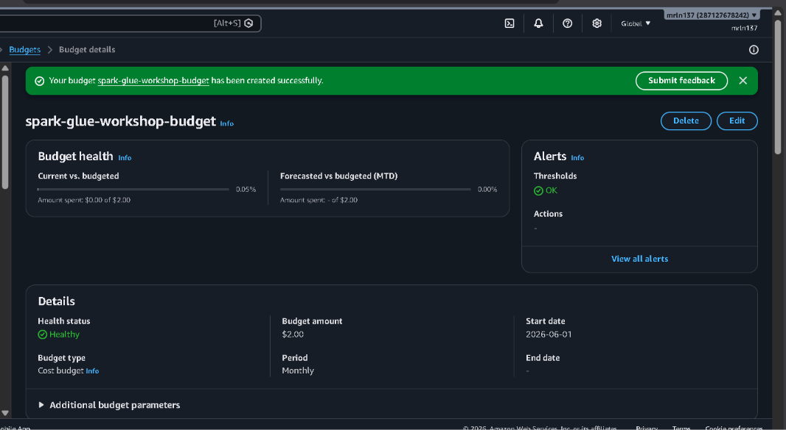
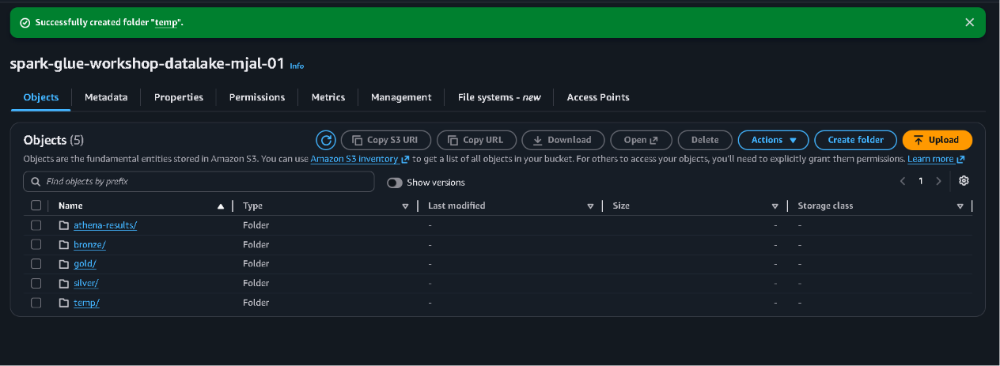
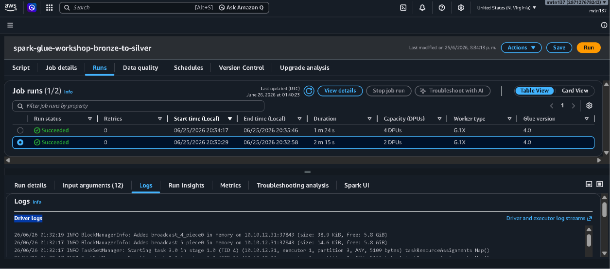
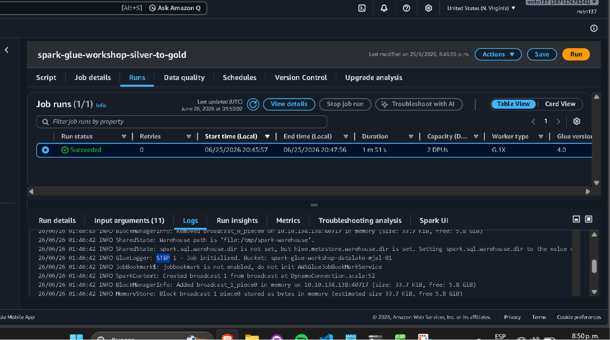

# Spark / AWS Glue Workshop

Pipeline ETL distribuido Bronze → Silver → Gold sobre el dataset Online Retail II,
construido con AWS Glue Studio, Step Functions y Athena.

## Evidencia del taller

### Paso 0 — Alerta de presupuesto

### Paso 2 — Bucket S3 con las 5 carpetas

### Step 5 — Job Bronze → Silver completado

### Paso 6 — Job Silver → Gold completado (modelo estrella)
